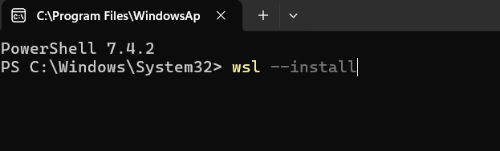
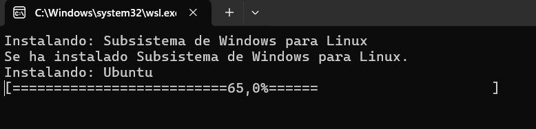
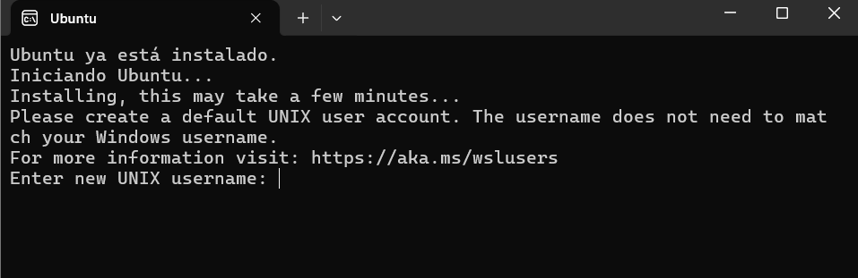
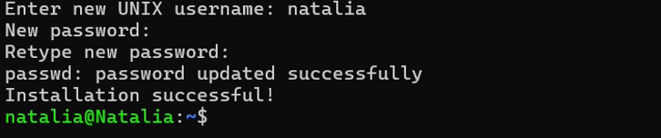

# Instalación de Ubuntu WSL

Comando que habilita las características necesarias para ejecutar WSL e instalará la distribución Ubuntu de Linux.

> wls --install

Una vez instalado, debemos crear un usuario y constraseña. No tiene por que ser la misma que la de nuestro Windows.

Una vez la instalación completada, debemos reiniciar para que se actualicen los cambios.
